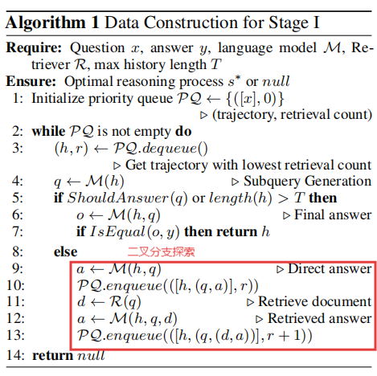

# 常见的损失函数

## 基于距离的损失函数

**均方误差损失函数（MSE)**，$$y_i$$是真实值，$$\hat{y_i}$$是预测值，n是样本数量。对误差很敏感。
$$
L_{\text{MSE}} = \frac{1}{N} \sum_{i=1}^{n} (y_i - \hat{y}_i)^2
$$
**平均绝对误差（MAE）**，计算预测值与真实值之差的绝对值的平均值。它对异常值不敏感，因为绝对值的增长是线性的，不会放大大误差，对异常值鲁棒性强。
$$
L_{MAE} = \frac{1}{N} \sum_{i=1}^{N} |y_i - \hat{y}_i|
$$
**Huber Loss**，Huber Loss 是 MSE 和 MAE 的混合体。它引入了一个超参数 $\delta$  来定义一个阈值：

1. 当预测误差的绝对值**小于或等于** $\delta$ 时，损失采用 **MSE** 的形式（平方损失）。
2. 当预测误差的绝对值**大于** $\delta$ 时，损失采用 **MAE** 的形式（线性损失）。

$$
L_\delta(y_i, \hat{y}_i) = \begin{cases} \frac{1}{2}(y_i - \hat{y}_i)^2 & \text{if } |y_i - \hat{y}_i| \le \delta \\ \delta(|y_i - \hat{y}_i| - \frac{1}{2}\delta) & \text{if } |y_i - \hat{y}_i| > \delta \end{cases}
$$

## 基于概率分布损失函数

**交叉熵损失**

二分类，其中$$y_i$$是真实标签（0或者1），$$\hat{p_i}$$是预测概率。如果真实标签是正类 (1)，损失会根据 $\log(p)$ 计算。模型越是自信地预测为正类（$p$ 接近 1），损失越低。如果真实标签是负类 (0)，损失会根据 $\log(1-p)$ 计算。模型越是自信地预测为负类（$p$ 接近 0），损失越低。
$$
L = - \frac{1}{N} \sum_{i=1}^{N} [y_i \log(\hat{p}_i) + (1 - y_i) \log(1 - \hat{p}_i)]
$$
多分类，真实标签使用One-Hot编码，$M$ 为类别总数，$y_{i,c}$ 为 One-Hot 编码下的真实标签（若样本 $i$ 属于类别 $c$ 则为 $1$，否则为 $0$），$\hat{p}_{i,c}$ 为预测样本 $i$ 属于类别 $c$ 的概率。
$$
L_{CCE} = - \frac{1}{N} \sum_{i=1}^{N} \sum_{c=1}^{M} y_{i,c} \log(\hat{p}_{i,c})
$$
**Hinge Loss**，其中，$y_i$是真实标签（+1 或 -1），$s_i$是预测值（未经过 softmax）。Hinge Loss 主要用于支持向量机（SVM），目标是最大化分类间隔。它惩罚那些预测值在正确分类一侧但距离决策边界太近的样本（即间隔内的样本）。
$$
L_{Hinge} = \max(0, 1 - y_i s_i)
$$
**KL散度**，用来衡量两个概率分布$P$与$Q$之间的差异。
$$
D_{KL}(P || Q) = \sum_{x} P(x) \log\left(\frac{P(x)}{Q(x)}\right)
$$

## 对比学习损失函数

**Contrastive loss**，$D_{a,b}$ 为嵌入空间中两个样本 $x_a$ 和 $x_b$ 之间的距离（通常是欧几里得距离），$Y$ 为相似标签（$Y=0$ 表示相似，$Y=1$ 表示不相似），$m$ 为最小间隔。
$$
L_{Contrastive} = \frac{1}{2N} \sum_{i=1}^{N} \left( (1-Y) D_{a,b}^2 + Y \max(0, m - D_{a,b})^2 \right)
$$
**Triplet loss**，$D(A, P)$ 为 **Anchor** (A) 和 **Positive** (P) 的距离，$D(A, N)$ 为 **Anchor** (A) 和 **Negative** (N) 的距离。要求锚点与正样本距离锚点与负样本至少一个margin。
$$
L=max(0,d(A,P)−d(A,N)+margin)
$$

# 论文标题：Can Knowledge-Graph-based Retrieval Augmented Generation Really Retrieve What You Need?

## Loss 设计目标

1. **奖励分解：**将最终奖励有效地分解到轨迹上的每一个中间状态上。
2. **策略对齐：**让模型生成路径的概率与奖励一致。、
3. **有限探索：**路径不是在大型 KG 上找，而是在局部领域内进行受限的探索。

## Loss整体结构

$$
\mathcal{L}_{DBLE}(s_{t}) = \sum_{i=0}^{k} \left[\log F(s_{t}) - \log F(s_{t+1,i}^{\prime}) + r_{\theta}(s_{t},a_{t,i}^{\prime}) - \log \sum_{j=0}^{k}e^{r_{\theta}(s_{t},a_{t,j}^{\prime})}\right]^{2}
$$

详细平衡损失+局部探索损失。$$log F(·)$$ 由 **Flow Head** 预测；$$ r_{\theta}(\cdot) $$由 **Policy Head** 预测（随后用于 Softmax 计算 $\log P(\cdot)$）

# 论文标题：Reasoning on Graphs: Faithful and Interpretable Large Language Model Reasoning

## Loss 设计目标

RoG 的损失函数旨在解决以下关键问题：

1. **幻觉问题**：LLM 在推理过程中容易产生不准确的推理步骤

2. **过程监督缺失**：需要让 LLM 学会基于检索到的推理路径进行忠实推理
3. **LLM 缺乏 KG 知识**：LLM 无法直接生成基于 KG 的忠实关系路径

因此，RoG 设计了**双任务优化框架**，通过联合训练**规划模块**和**检索推理模块**来解决这些问题。

## Loss 整体结构

$$
\mathcal{L} = -\underbrace{\log P_{\theta}(a \mid q, Z_{K}^*, G)}_{\text{检索推理优化}} - \underbrace{\frac{1}{|Z^*|} \sum_{z \in Z^*} \log P_{\theta}(z \mid q)}_{\text{规划优化}}
$$

**解释：**ROG损失函数的推导始于一个概率模型设定，然后通过引入变分推断来优化其证据下界（ELBO），最终分解为两个可以实际优化的损失项：**规划损失**和**推理损失**。

1. 建立概率模型与最终目标，先基于问题生成一个关系路径，再基于这个计划和知识图谱生成最终答案。

$$
P_{\theta}(a|q,\mathcal{G})=\sum_{z\in\mathcal{Z}}P_{\theta}(a|q,z,\mathcal{G})P_{\theta}(z|q)
$$

2. 直接优化上式困难，因此论文采用了最大化证据下界（ELBO）来优化这个目标函数。ELBO将目标分解为两个部分（具体分解过程见RoG笔记）：

$$
log~P(a|q,\mathcal{G})\ge\mathbb{E}_{z\sim Q(z)}[log~P_{\theta}(a|q,z,\mathcal{G})]-D_{KL}(Q(z)||P_{\theta}(z|q))
$$

最大化这个ELBO目标就是**最大化**期望$\mathbb{E}_{z\sim Q(z)}[log~P_{\theta}(a|q,z,\mathcal{G})]$，**最小化**$D_{KL}(Q(z)||P_{\theta}(z|q))$

$$Q(z)$$是一个后验分布来近似未知的后验分布$$P(z|a,q,\mathcal{G})$$,在实际的规划优化中，由于计算所有有效路径很困难，该分布被进一步近似为**仅使用连接问题实体 $e_q$ 和答案实体 $e_a$ 之间的最短路径 $\mathcal{Z}^{*}$**:
$$
Q(z)\simeq Q(z|a,q,\mathcal{G})=\begin{cases}\frac{1}{|\mathcal{Z}|},\exists w_{z}(e_{q},e_{a})\in\mathcal{G},\\ 0,else,\end{cases}
$$

3. 将定义好的$$Q(z)$$带入ELBO的两项：

   1. 规划损失：$\mathcal{L}_{plan} = D_{KL}(Q(z|a, q, G)∥P_{\theta}(z|q)) $=$ \mathbb{E}_{z\sim Q(z|a,q,G)}[log Q(z|a, q, G) − log P_{\theta}(z|q)]=$$−\mathbb{E}_{z\sim Q(z|a,q,G)}log P_{\theta}(z|q) + CONST$

      $\mathcal{L}_{plan} \simeq-\frac{1}{|\mathcal{Z}^{*}|}\sum_{z\in\mathcal{Z}^{*}}log~P_{\theta}(z|q)$

   2. 推理损失:$\mathcal{L}_{reason} = \mathbb{E}_{z\sim Q(z|a,q,\mathcal{G})}[log~P_{\theta}(a|q,z,\mathcal{G})] \simeq log~P_{\theta}(a|q,\mathcal{Z}_{K}^{*},\mathcal{G})$

4. 优化目标：$\mathcal{L} = \log P_{\theta}(a|q, \mathcal{Z}_{K}^{*}, \mathcal{G}) + \frac{1}{|\mathcal{Z}^{*}|} \sum_{z \in \mathcal{Z}^{*}} \log P_{\theta}(z|q)$

# 论文标题：Knowledge Graph-Enhanced Large Language Models via Path Selection

## Loss设计目标

训练一个编码器$$M$$，使其能够衡量问题 q 与路径 p 之间的语义相关性； 识别出那些能帮助 LLM 生成正确答案的路径，即使这些路径与问题在表面上语义不直接相关，也能被正确识别。

## Loss整体结构

该损失函数是基于余弦相似度的成对排序损失
$$
\mathcal{L}=\sum_{q}max(cos(h_{q},h_{q}^{-})-cos(h_{q},h_{q}^{+})+\eta,0)
$$
其中，$$h_q=M(q)$$:输入问题q的编码向量；$h_{q}^{+}=M(p_{q}^{+})$:正样本知识路径$$p_{q}^{+}$$编码向量；$h_{q}^{-}=M(p_{q}^{-})$:负样本知识路径$$p_{q}^{-}$$编码向量；

正样本：当某个路径 p 加入 prompt 后，LLM 从错误输出变为正确输出；

负样本：加入路径 p 后，LLM 的输出仍然错误；

# 论文标题：DeepRAG: Thinking to Retrieve Step by Step for Large Language Models

## Loss设计目标

1. 通过模仿学习，让模型学会正确的“分解-->检索-->回答”模式。
2. 使模型能够动态决定何时检索外部知识、何时依赖内部参数知识。

## Loss整体结构

该 Loss 由两阶段构成：

Stage 1：掩码负对数似然，在标准的NLL基础上，它通过**“掩盖”**序列中的特定部分来控制哪些Token的预测误差要计入总损失中，哪些要被忽略。
$$
L = -\sum_{1\leq i \leq n} \log [\Pr(q_i|s_{i-1}) + \Pr(a_i|s_{i-1}, q_i, d_i)]
$$
$s_{i-1}$:上一步状态；$q_i$:生成的第$i$个子查询；$a_i$:第i步中间回答；通过最大化子查询生成概率和最大化中间答案生成概率来训练模型学习推理模式。

Stage 2：DPO风格的损失函数，直接从偏好数据中推导出模型应该优化的方向，无需显式训练一个独立的奖励模型，从而大大简化了对齐过程。
$$
L = - \log \sigma \left( \beta \log \frac{\pi_\theta(y_w | s_i, q_i)}{\pi_{ref}(y_w | s_i, q_i)} - \beta \log \frac{\pi_\theta(y_l | s_i, q_i)}{\pi_{ref}(y_l | s_i, q_i)} \right)
$$
$y_w$：模型期望输出的“获胜”/“更好”的响应。

$y_l$：模型期望避免输出的“失败”/“更差”的响应。

$\pi_\theta(\cdot | x)$：当前正在训练的模型，其目标是增大 $y_w$ 的概率，减小 $y_l$ 的概率。

$\pi_{ref}(\cdot | x)$：参考模型（通常是基座模型或上一个阶段的模型）。这一项用来防止模型偏离原始预训练知识太远

$\beta$：控制模型对偏好数据的**学习强度**。$\beta$ 越大，模型越激进地去满足偏好。

$ \log \frac{\pi_\theta(y_w | s_i, q_i)}{\pi_{ref}(y_w | s_i, q_i)}$：衡量了当前模型$\pi_\theta$：相对于参考模型$\pi_{ref}$对优选回答$y_w$的偏好程度。

$ \log \frac{\pi_\theta(y_l | s_i, q_i)}{\pi_{ref}(y_l | s_i, q_i)}$：这衡量了当前模型相对于参考模型，对非优选回答$y_l$偏好程度。

括号内容计算的是**“对优选的相对偏好”**与**“对非优选的相对偏好”**之间的**差值**。当损失函数越小，这个差值就越大。模型越偏好$y_w$

# 论文标题：RankCoT: Refining Knowledge for Retrieval-Augmented Generation through Ranking Chain-of-Thoughts

## Loss设计目标

RankCoT 的设计目标是解决 RAG 中检索文档包含噪声的问题。使模型在面对大量文档（包含噪声）时，能够识别并“关注”那些能推导出正确答案的文档内容，抑制由无关文档生成的推理路径。

## Loss整体结构

$$
\mathcal{L} = -\mathbb{E}_{(q, D, y_{CoT}^+, y_{CoT}^-) \sim \mathcal{D}} \left[ \log \sigma \left( \beta \log \frac{\mathcal{M}(y_{CoT}^{+}|q,D)}{\mathcal{M}^{Ref}(y_{CoT}^{+}|q,D)} - \beta \log \frac{\mathcal{M}(y_{CoT}^{-}|q,D)}{\mathcal{M}^{Ref}(y_{CoT}^{-}|q,D)} \right) \right] 
$$

本质上是一个**二元分类问题**的 Loss，用于判断策略模型 $\mathcal{M}$ 相对于参考模型 $\mathcal{M}^{Ref}$，生成“赢家样本” $y_{CoT}^+$ 的概率是否比生成“输家样本” $y_{CoT}^-$ 的概率**高出足够多**。

期望是对整个训练集的损失进行平均化处理，确保模型在所有样本上都能达到最优泛化效果。

**$\mathcal{M}(y|q,D)$：** 当前策略模型（Policy Model）在给定完整输入 $q, D$ 下，生成输出 $y$ 的对数概率。

**$\mathcal{M}^{Ref}(y|q,D)$：** 冻结的参考模型（Reference Model）在相同输入下，生成输出 $y$ 的对数概率。

$\log \frac{\mathcal{M}}{\mathcal{M}^{Ref}}$ 衡量的是策略模型 $\mathcal{M}$ 相较于基准 $\mathcal{M}^{Ref}$ 对该序列 $y$ 的**相对信心提升**。

Sigmoid $\sigma(\cdot)$： 将 $\Delta r$（从 $-\infty$ 到 $+\infty$）映射到一个概率值（从 0 到 1）。这个值 $\sigma(\Delta r)$ 代表了策略模型 $\mathcal{M}$ 认为 $y_{CoT}^+$ 优于 $y_{CoT}^-$ 的概率。

# DeepRAG

## 研究的问题

LLM对自身“知识边界认知不足”，现有方法往往无法准确判断何时需要检索外部知识，何时可以依赖模型自身的参数化知识，导致**冗余检索**和**噪声引入**。

研究的问题是：如何通过逐步思考与自适应检索在大语言模型中实现更高效/更准确的检索增强生成。

## 贡献

1. 提出了一个受人类思维启发的检索增强生成框架：DeepRAG，将复杂的检索增强推理过程建模为一个马尔可夫决策过程，使模型能够像人类一样“逐步思考”，动态决定何时检索、何时依赖自身知识。
2. 设计了一套结合“模仿学习”与“校准链”的端到端训练方法。

## 主要内容

### MDP建模

MDP由四个要素组成：（S,A,P,R）

- 状态$s_t$被定义为$s_t = [x, (q₁, r₁), ..., (q_t, r_t)]$,$x$是初始问题，$q_i$是第i步生成的子查询，$r_i$是第i步的中间答案（可能包含检索到的文档$d_i$）
- 动作：在每一个状态$s_t$都执行一个复合动作：$a_{t+1} = (σ_{t+1}, δ_{t+1})$
  - 终止决策：$σ_{t+1} ∈ \{continue, terminate\}$
    - continue：继续生成下一个子查询 $q_{t+1}$
    - terminate：终止过程，并生成最终答案 
  - 原子决策：$δ_{t+1} ∈ \{retrieve, parametric\}$
    - retrieve：为子查询$q_{t+1}$检索外部文档。
    - parametric：仅依靠模型自身的参数化知识来回答 $q_{t+1}$

- 状态转移：根据模型选择的动作来更新状态
- 奖励：奖励函数仅在生成最终答案后计算，$R(s_{t+1}) = -C(o) × T(s_t)$,$C(o)$:最终答案的正确性（正确为1，错误为$\infty$）,$T(s_t)$:在整个状态$s_t$中发生的总检索次数。
  - 这个函数**优先保证答案正确性**（如果错误，奖励为负无穷），在答案正确的前提下，**鼓励模型尽可能少地使用检索**。

### 数据构建

作者设计二元树搜索算法来合成高质量的“推理轨迹数据”

- 核心操作：对于每一个生成的子查询，算法会同时探索两条路径：
  1. 蓝色节点：参数化路径。不进行检索，直接让模型（目标模型）基于自身知识生成中间答案。
  2. 绿色节点：检索路径。使用检索器获取相关文档，然后让模型基于文档生成中间答案。
- 构建搜索树：通过这种“一分为二”的探索，可以为每个问题构建出一棵庞大的二元推理树，其中包含了所有可能的子查询序列和决策组合。
- 目标：在这棵树中，寻找那些能够最终得出正确答案且检索次数最少的推理路径。这些路径就是最优的“思考-检索”轨迹。
- 以下算法是具体实现：

### 第一阶段训练：模仿学习

在通过二元树搜索合成出大量最优推理路径数据后，第一阶段训练的目标是让目标模型学会模仿这些最优行为。

- **训练数据**：二元树搜索找到的“黄金轨迹”，即(子查询，原子决策，中间答案) 序列。
- **训练目标**：通过监督学习微调模型，使其能够：
  1. 根据当前状态生成合理的下一个子查询。
  2. 做出正确的**终止决策**和**原子决策**。
  3. 生成忠实可靠的中间答案。
- masked 损失函数：一个重要的细节是，在计算损失时，对检索到的文档 $d_i$ 进行了掩码处理。这意味着模型在学习生成答案时，不会直接学习文档中的具体文本，而是学习如何利用检索到的信息。这防止模型记忆噪声文本，并增强了其根据上下文生成答案的能力。

经过这一阶段训练后，得到的模型称为 DeepRAG-Imi，它已经具备了初步的逐步推理和自适应检索能力。

### 第二阶段训练：校准链

这一阶段主要是让模型明确自己的知识边界，做出更精准的原子决策。

- **合成偏好数据**：

  - 使用训练好的DeepRAG-Imi模型和二元树搜索，再次为问题寻找最优路径。

  - 对于最优路径中的**每一个子查询**，我们都明确知道其正确的原子决策是什么（是检索还是不检索）。

  - 由此，我们可以为每个子查询构建一个**偏好对** (首选决策， 次选决策)。例如，对于第一个子查询，如果最优路径是“不检索”，那么偏好对就是 (parametric, retrieve)。

- **校准目标训练**：
  - 使用上述合成的偏好数据，采用类似于DPO的直接偏好优化方法对模型进行微调。
  - 训练目标是让模型对于给定的子查询，**赋予首选决策**（如“不检索”）**更高的概率**，同时**抑制次选决策**（如“检索”）的概率。
  - 这个过程不涉及学习整个推理路径，而是**专门、精细地校准模型的“原子决策”模块**，使其对自身知识边界更敏感。

